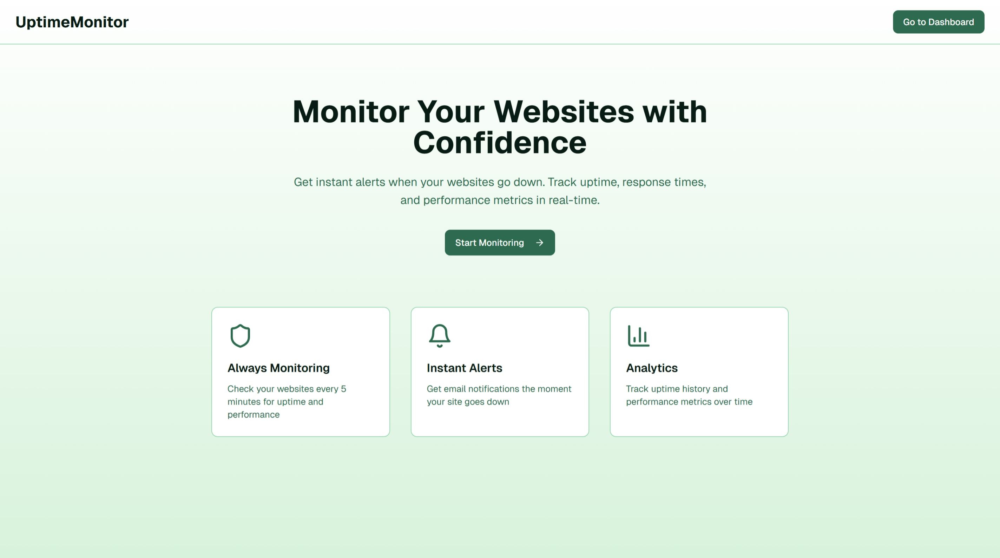
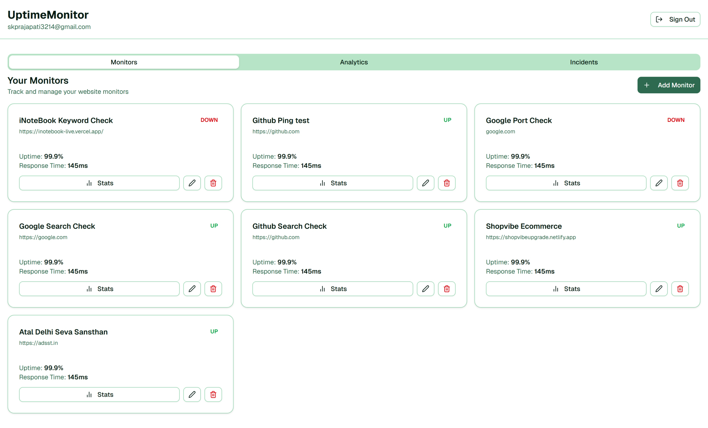

# UptimeRobot Clone

A robust, full-stack website uptime monitoring solution built with Next.js 16, Supabase, and Tailwind CSS. This application allows users to monitor their websites, APIs, and services, receiving instant alerts via email when downtime is detected.

 ### [Live Link](https://uptime-robot-clone.vercel.app/)
 





## 🚀 Features

-   **User Authentication**: Secure sign-up and login powered by Supabase Auth.
-   **Multi-Type Monitoring**:
    -   **HTTP/HTTPS**: Check website availability and response codes.
    -   **Ping**: ICMP ping to check if a server or device is reachable.
    -   **Keyword**: Verify if a specific keyword exists (or doesn't) on a page.
    -   **Port**: Monitor specific ports (TCP) for service availability.
-   **Real-time Dashboard**: View monitor status, response times, and uptime metrics at a glance.
-   **Incident Tracking**: Automatically records downtime incidents with start and end times.
-   **Email Notifications**: Instant alerts for UP/DOWN events via SMTP.
-   **Responsive Design**: Beautiful UI built with Tailwind CSS and Shadcn UI, fully responsive for mobile and desktop.
-   **Cron Integration**: Automated background checks using GitHub Actions.

## 🛠️ Tech Stack

-   **Framework**: [Next.js 16 (App Router)](https://nextjs.org/)
-   **Language**: TypeScript
-   **Database & Auth**: [Supabase](https://supabase.com/) (PostgreSQL)
-   **Styling**: [Tailwind CSS 4](https://tailwindcss.com/)
-   **UI Components**: [Shadcn UI](https://ui.shadcn.com/) / Radix UI
-   **Icons**: [Lucide React](https://lucide.dev/)
-   **Email**: Nodemailer
-   **Charts**: Recharts
-   **Forms**: React Hook Form + Zod

## 🏁 Getting Started

Follow these steps to set up the project locally.

### Prerequisites

-   Node.js 18+ installed
-   npm or pnpm installed
-   A [Supabase](https://supabase.com/) project (Free tier works great)
-   An SMTP provider (e.g., Gmail, Resend, SendGrid) for emails

### Installation

1.  **Clone the repository**

    ```bash
    git clone https://github.com/skp3214/uptimerobot-clone.git
    cd uptimerobot-clone
    ```

2.  **Install dependencies**

    ```bash
    npm install
    # or
    pnpm install
    ```

3.  **Environment Variables**

    Create a `.env` file in the root directory and add the following variables:

    ```env
    # Supabase Configuration
    NEXT_PUBLIC_SUPABASE_URL=your_supabase_project_url
    NEXT_PUBLIC_SUPABASE_ANON_KEY=your_supabase_anon_key
    SUPABASE_SERVICE_ROLE_KEY=your_supabase_service_role_key

    # App URL (Configuration for email links)
    NEXT_PUBLIC_APP_URL=http://localhost:3000

    # SMTP Configuration (For Email Alerts)
    SMTP_HOST=smtp.example.com
    SMTP_PORT=587
    SMTP_USER=your_smtp_user
    SMTP_PASSWORD=your_smtp_password

    # Cron Security
    CRON_SECRET=your_random_secret_string
    ```

4.  **Database Setup**

    This project uses Supabase as the backend. You need to set up the database schema.
    
    1.  Go to your Supabase Dashboard -> SQL Editor.
    2.  Open the files in the `scripts/` directory of this project.
    3.  Run the contents of the scripts in the following order:
        -   `scripts/01-init-schema.sql` (Creates tables: users, monitors, incidents, notifications, etc.)
        -   `scripts/02-add-user-trigger.sql` (Sets up automatic user profile creation on signup)
        -   `scripts/03-add-monitor-types.sql` (Updates enums/columns for advanced monitoring)

5.  **Run Development Server**

    ```bash
    npm run dev
    ```

    Open [http://localhost:3000](http://localhost:3000) to view the app.

## 📂 Project Structure

```
├── app/                # Next.js App Router pages and API routes
│   ├── api/            # Backend API (Auth, Cron, Monitors)
│   ├── auth/           # Authentication pages (Login/Signup/Callback)
│   ├── dashboard/      # Protected dashboard routes
│   └── page.tsx        # Landing page
├── components/         # Reusable UI components
│   ├── ui/             # Shadcn UI primitives
│   └── ...             # Feature-specific components
├── lib/                # Utility functions
│   ├── supabase/       # Supabase client/server setup
│   ├── email.ts        # Email sending logic
│   └── monitor.ts      # Monitoring check logic
├── scripts/            # SQL scripts for database setup
└── public/             # Static assets
```
